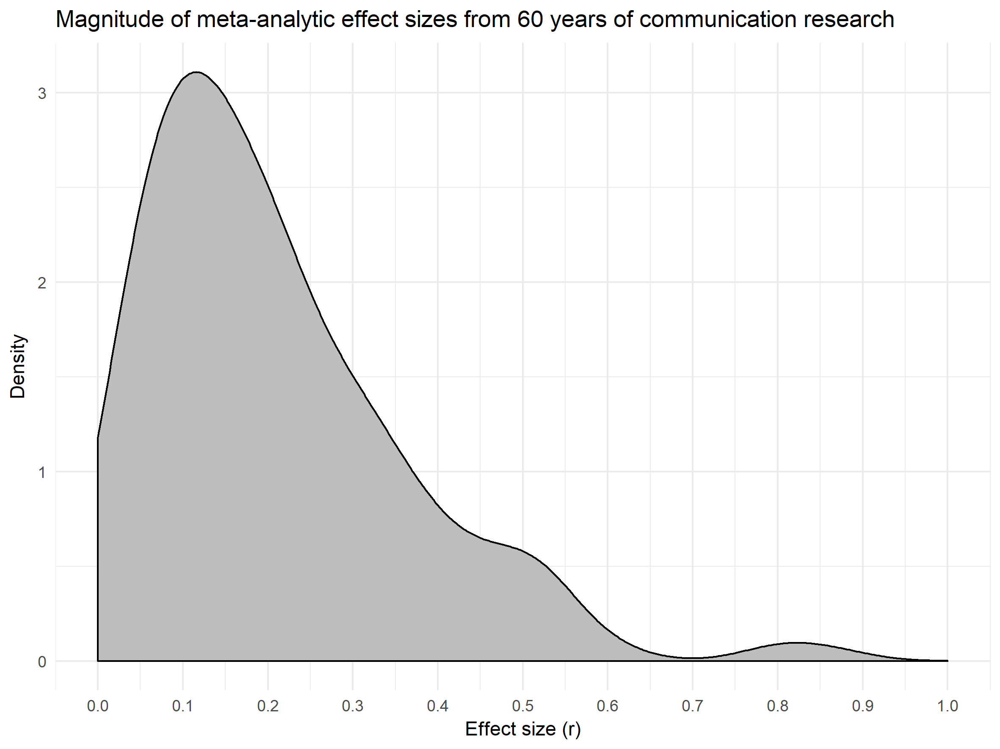
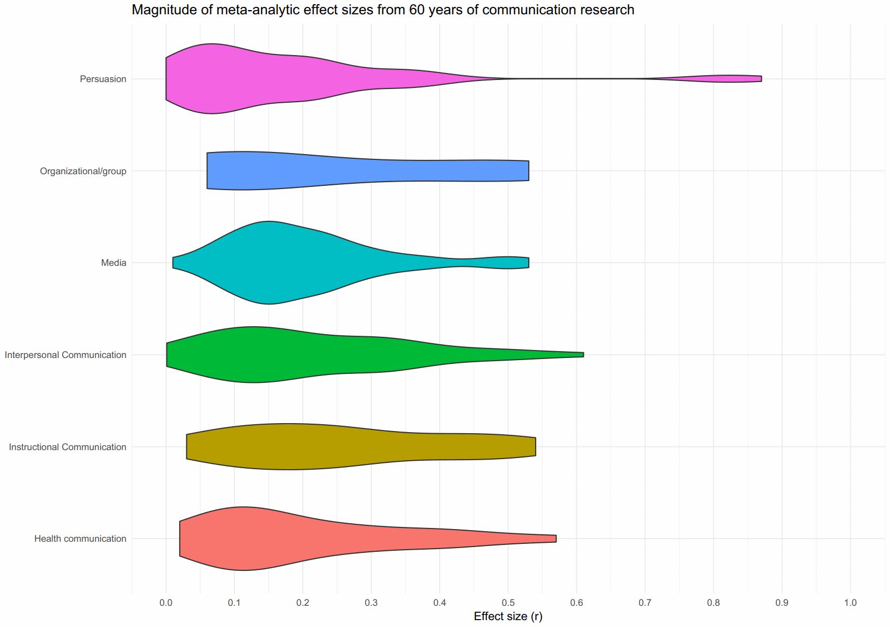

# Effect sizes from 60 years of communication research

A total of 214 effect sizes from 149 meta-analyses from communication research during 60 years extracted from the study by Rains, Levine, & Weber (2018) into a comma-separated CSV file.





## Headers

- `originalorder` is the order of the effect size as in Rains, Levine, & Weber (2018).
- `field` is one of 6 research fields the effect sizes are grouped into, as in Rains, Levine, & Weber (2018).
- `topic` is a topic that each description is grouped under.
- `description` is a short description of the effect size in question.
- `r` is the mean effect size (Pearson's r).
- `ci_lower` is the lower bound of the 95 % confidence interval of r.
- `ci_upper` is the upper bound of the 95 % confidence interval of r.
- `k` is the number of studies.
- `n` is the number of participants in the specific meta-analysis.
- `reference` is a short reference to the specific meta-analysis (in the format `Author, yyyy`).
- `year` is when the meta-analysis was published (extracted from reference).

Missing values are denoted by `NA`. Fields that contain missing values are `ci_lower`, `ci_upper`, `n` and `k`.

## Fields

- Health communication
- Instructional Communication
- Interpersonal Communication
- Media
- Organizational/group
- Persuasion

## Import into R

```r
df <- read.csv("https://raw.githubusercontent.com/peterdalle/effectsizes-comm/master/effectsizes.csv",
               header=TRUE, sep=",", stringsAsFactors=FALSE)

# Set as factors.
df$field <- as.factor(df$field)
df$topic <- as.factor(df$topic)

# Mean effect size.
mean(df$r)

# Summary of number of participants.
summary(df$n)

# Summary of number of meta-analyses.
summary(df$k)

library(tidyverse)
library(ggridges)
theme_set(theme_minimal())

# Histogram of r.
df %>% 
  ggplot(aes(r)) +
  geom_histogram()

# Density plot of r.
df %>%
  ggplot(aes(r)) +
  geom_density(fill="gray") +
  scale_x_continuous(breaks=seq(0, 1, 0.1), limits=c(0, 1)) + 
  labs(title="Magnitude of meta-analytic effect sizes from 60 years of communication research",
       x="Effect size (r)", y="Density")

# Violin plot of r by field.
df %>%
  ggplot(aes(field, r, fill=field)) +
  geom_violin() +
  scale_y_continuous(breaks=seq(0, 1, 0.1), limits=c(0, 1)) + 
  theme(legend.position = "none") +
  coord_flip() + 
  labs(title="Magnitude of meta-analytic effect sizes from 60 years of communication research",
       x=NULL, y="Effect size (r)")

# Joy plot or r by field.
df %>%
  ggplot(aes(r, field, fill=field)) +
  geom_density_ridges() +
  scale_x_continuous(breaks=seq(0, 1, 0.1), limits=c(0, 1)) + 
  theme(legend.position = "none") +
  labs(title="Magnitude of meta-analytic effect sizes from 60 years of communication research",
       y=NULL, x="Effect size (r)")

# Box plot of r by field.
df %>%
  ggplot(aes(field, r, fill=field)) +
  geom_boxplot() +
  scale_y_continuous(breaks=seq(0, 1, 0.1), limits=c(0, 1)) + 
  theme(legend.position = "none") +
  coord_flip() +
  labs(title="Magnitude of meta-analytic effect sizes from 60 years of communication research",
       x=NULL, y="Effect size (r)")

# Plot mean effect size by year.
df %>%
  group_by(year) %>%
  summarize(meanr = mean(r)) %>%
    ggplot(aes(year, meanr)) +
    geom_point() + 
    scale_y_continuous(breaks=seq(0, 1, 0.1), limits=c(0, 1)) + 
    scale_x_continuous(breaks=seq(1984, 2015, 4), limits=c(1984, 2015)) + 
    labs(title="Mean effect size by year",
         x="Year", y="Mean effect size (r)")
```

## Import into Python

```python
import pandas as pd
import numpy
import matplotlib.pyplot as plt

data = pd.read_csv("https://raw.githubusercontent.com/peterdalle/effectsizes-comm/master/effectsizes.csv", sep=",")

# What is the mean effect size from all meta-analyses?
numpy.mean(data["r"])

# Histogram.
plt.hist(data["r"], bins="auto")
plt.title("Magnitude of meta-analytic effect sizes in communication research")
plt.show()
```

## See also

- [Effect sizes from one hundred years of social psychology](https://github.com/peterdalle/effectsizes)

## Reference

Rains, S. A., Levine, T. R., & Weber, R. (2018). Sixty years of quantitative communication research summarized: lessons from 149 meta-analyses. *Annals of the International Communication Association*, 1–20. <https://doi.org/10.1080/23808985.2018.1446350>
